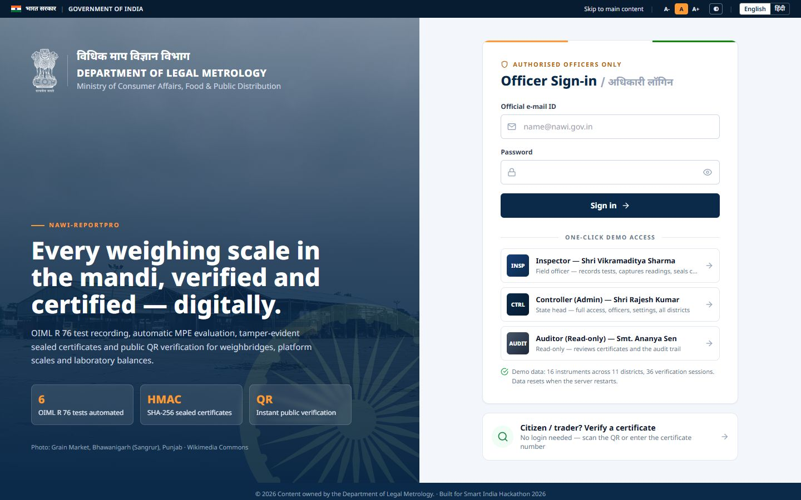
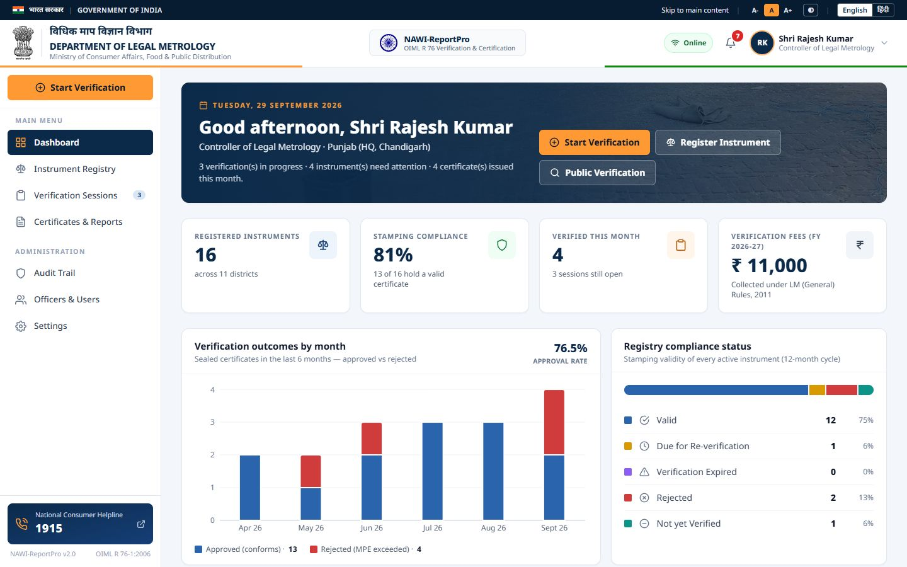
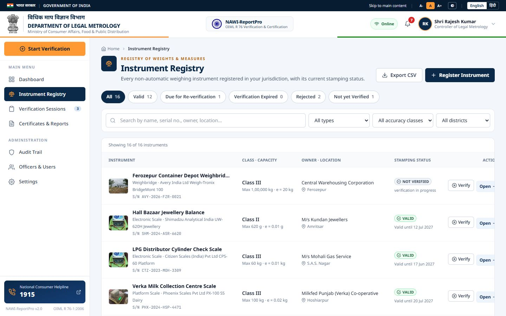
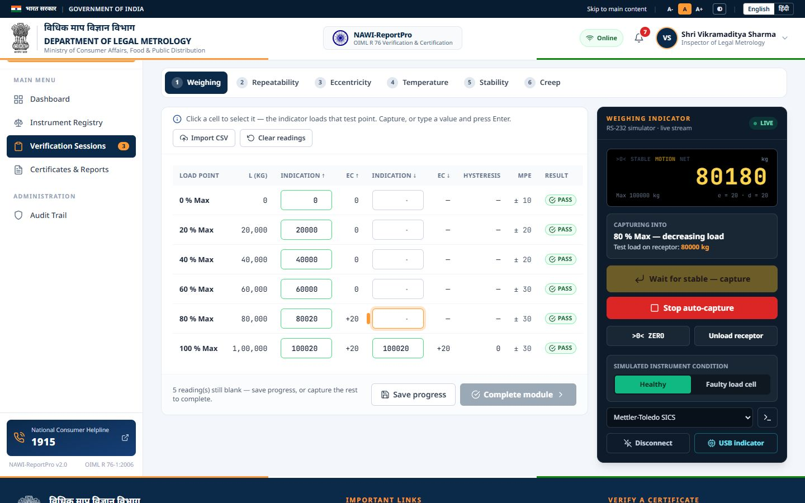
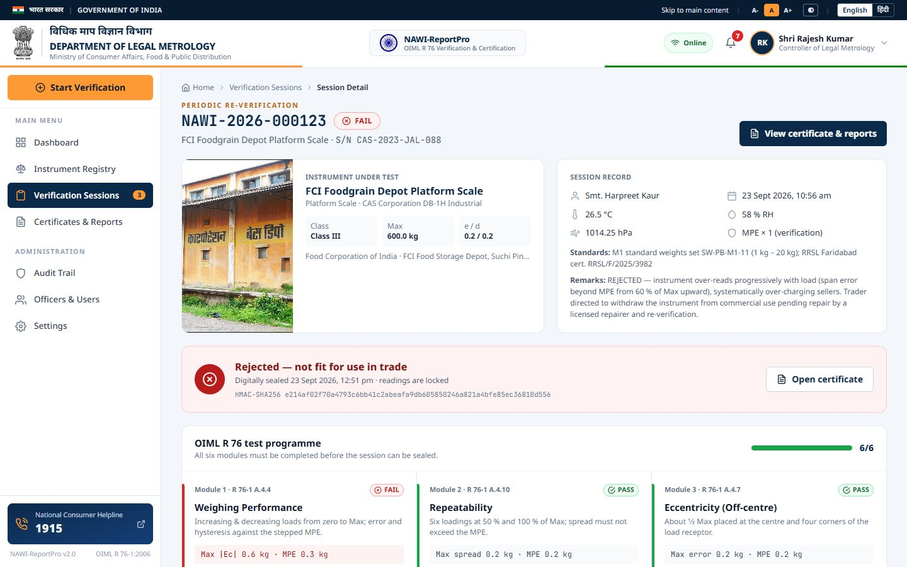
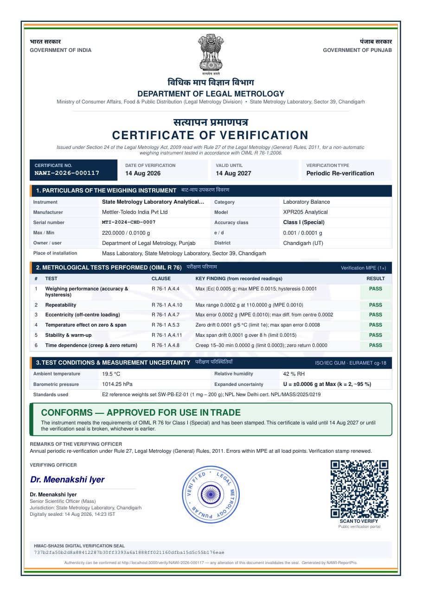
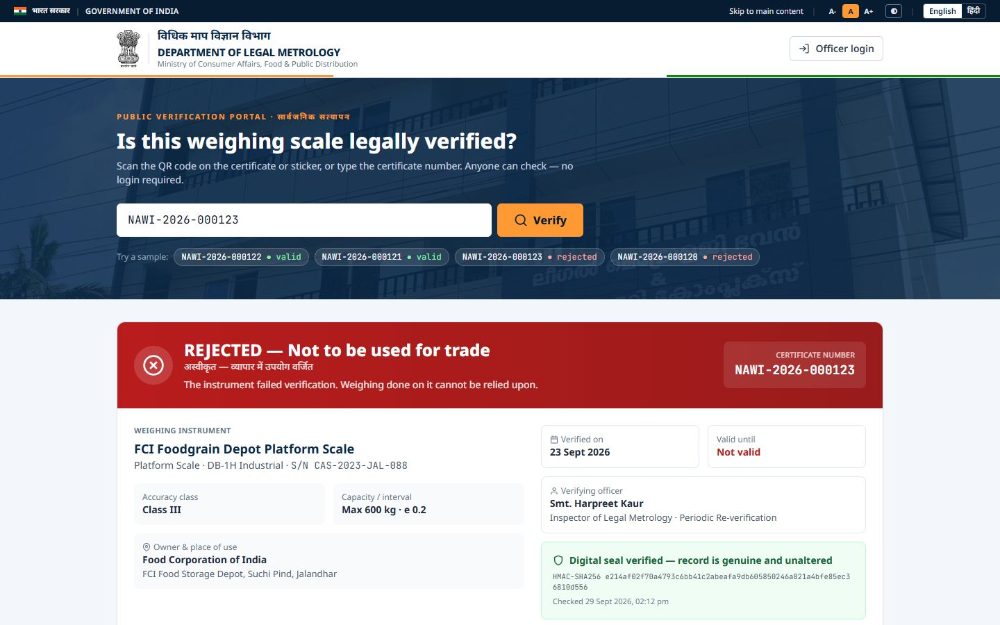
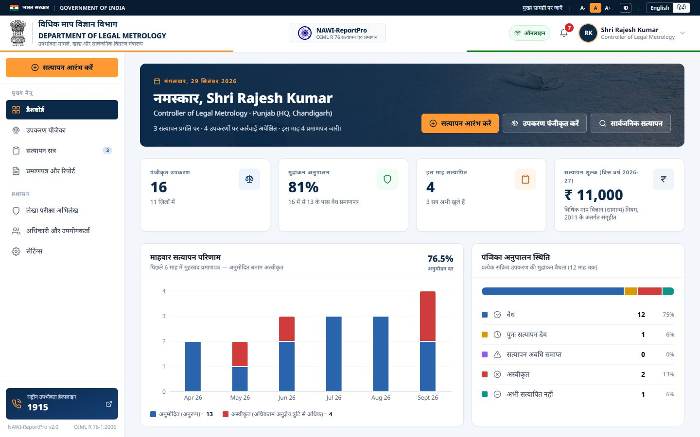

<div align="center">


# NAWI-ReportPro

**विधिक माप विज्ञान विभाग · Department of Legal Metrology**

Digital verification and certification of **non-automatic weighing instruments** under **OIML R 76-1:2006** and the **Legal Metrology Act, 2009**. It covers every step from the officer's field readings to a sealed, QR-verifiable certificate a citizen can check on their phone.

*Smart India Hackathon 2026*

</div>

---

## Run it in one minute

```bash
npm install
npm run demo
```

Open **http://localhost:3000**. No database or configuration is needed: `npm run demo` starts the API on an in-memory database with a realistic demo dataset.

| Role (one-click on the login page) | E-mail | Password | Can do |
|---|---|---|---|
| **Inspector** — Shri Vikramaditya Sharma | `inspector@nawi.gov.in` | `Inspector@123` | Record tests, capture readings, seal certificates |
| **Controller (Admin)** — Shri Rajesh Kumar | `admin@nawi.gov.in` | `Admin@123` | Everything, plus officers, settings and demo reset |
| **Auditor (read-only)** — Smt. Ananya Sen | `viewer@nawi.gov.in` | `Viewer@123` | Review sessions, certificates and the audit trail |

The demo data covers 16 instruments across 11 Punjab districts, including:
- mandi weighbridges and an FCI foodgrain-depot platform scale
- a PDS ration-shop scale, a Verka milk-collection scale and an LPG cylinder scale
- a jeweller's balance and State Metrology Laboratory balances

There are 36 verification sessions over 12 months, 7 officers and more than 300 audit entries. Every verdict is computed by the same OIML engine the live API uses.

## A 3-minute walkthrough for judges

1. **Sign in as the Inspector.** The dashboard shows:
   - stamping compliance for the whole registry;
   - monthly approvals and rejections;
   - instruments that are due, expired or rejected;
   - a district-wise summary;
   - the verification fees collected.
2. **Verification Sessions → "Bathinda Cotton Mandi Platform Scale"** (5 of 6 modules done). Open **Creep** and press **Auto-capture remaining**:
   - The simulated RS-232 indicator loads each test point.
   - It waits for a stable reading and captures it.
   - The error, MPE and verdict are evaluated live.
3. **Complete module → Finalise & seal.** The dialog shows the verdict, which is computed automatically and cannot be overridden. Signing it:
   - issues the certificate;
   - applies an HMAC-SHA256 seal;
   - opens the PDF preview.
4. **See a rejection.** Start a verification on any instrument, switch the indicator to **Faulty load cell** and capture the Weighing test. The out-of-tolerance points turn red, and sealing issues a **Certificate of Rejection**.
5. **Public verification.** Open `/verify` (no login) and pick a sample certificate. The portal re-computes the seal and shows **VALID** or **REJECTED**, together with the owner, location, officer and error curve. It works on a phone.
6. **Switch to हिंदी** in the top strip. The whole interface is bilingual.

## What it does

| Area | Highlights |
|---|---|
| **Instrument registry** | Registration with live checks against OIML R 76 Table 3 (n = Max/e, Min ≥ k·e, d ≤ e) and an MPE preview. Each instrument's stamping status is derived from the statutory 12-month validity: *Valid · Due · Expired · Rejected · Not verified*. |
| **Six OIML R 76 tests** | Weighing performance (Ec = E − E₀, hysteresis), repeatability, eccentricity, temperature effect (zero drift per 5 °C), stability, and time dependence (creep and zero return). Stepped MPE per accuracy class, with 2 × MPE for in-service inspection. |
| **Indicator capture** | A live RS-232 stream (Mettler-Toledo SICS, Avery Weigh-Tronix or Essae protocols) with stability detection, zero and tare, guided per-cell capture and auto-capture. Readings are never recorded unless the indicator has settled on the test load. A **Web Serial** option connects a real USB indicator. |
| **Integrity** | Partial saves never count as complete. A session can be sealed only when all six modules are done, and a sealed session is read-only. Only the owning officer or the Controller can record readings. Every action goes into an append-only audit trail. |
| **Certificates** | A one-page bilingual Certificate of Verification or Rejection, with the State Emblem, a QR code, an official stamp and the HMAC seal. A three-page Technical Data Sheet includes every reading, the ISO GUM uncertainty budget and the error-envelope chart. |
| **Public portal** | `/verify/:certificateNo` recomputes the seal in constant time, and shows the validity dates and a National Consumer Helpline (1915) link. |
| **GIGW 3.0** | Government of India utility strip, skip link, text size (A- / A / A+), high contrast, Hindi interface, Indian date and number formats, and a responsive layout. |
| **Field use** | Offline queue (IndexedDB) with an idempotent batch-sync endpoint, a service worker for the app shell in production builds, and CSV import of weighbridge readings. |

## Screenshots

| | |
|---|---|
|  |  |
|  |  |
|  |  |
|  |  |

## Architecture

```
client/   React 18 · Vite · Tailwind · TanStack Query · Recharts · pdf.js · i18next (EN/HI)
server/   Node.js · Express · Prisma (PostgreSQL) with an in-memory fallback · PDFKit · QR · HMAC-SHA256
tests/    Vitest + Supertest — 201 tests in five tiers (features, boundaries, combinations, scenarios, adversarial)
```

- `server/src/services/mpeCalculator.js` is the OIML R 76 engine: stepped MPE, multi-interval ranges, tare, hysteresis and all six tests.
- `server/src/services/uncertaintyCalculator.js` produces the GUM / EURAMET cg-18 expanded uncertainty.
- `server/src/services/pdfCertificate.js` and `pdfDataSheet.js` generate the official PDFs, including the Devanagari fonts.
- `client/src/components/telemetry/browserSimulator.js` simulates the RS-232 indicator in the officer's browser, with a healthy or a faulty load cell. `server/src/services/telemetrySimulator.js` offers the same indicator as an SSE stream for API clients; a parity test keeps the two identical.
- `server/src/lib/demoSeed.js` holds the deterministic demo dataset, which is shared by the in-memory database and `prisma db seed`.

### Using PostgreSQL instead of the demo database

```bash
cp .env.example .env        # set DATABASE_URL, JWT_SECRET, HMAC_SECRET
npm run setup:postgres      # migrate + seed the same demo data
npm run dev
```

### Deploying on Vercel (public demo)

The repository deploys as one Vercel project: the React app as static files and the API as a serverless function (`api/index.js`, routed by `vercel.json`).

1. Import the GitHub repository in Vercel. Keep the settings from `vercel.json` (no framework preset).
2. In the project, open **Storage → Create database → Neon (Postgres)** and connect it. This sets `DATABASE_URL`.
3. In **Settings → Environment Variables**, add `HMAC_SECRET` and `JWT_SECRET`: two different long random strings (for example `openssl rand -hex 32`). Certificates are sealed with `HMAC_SECRET`, so never change it after the first deploy.
4. Deploy. The build (`scripts/vercel-build.sh`) applies the migrations and loads the demo register into the empty database; later deploys keep the data.

Certificate QR codes point to the project's production domain automatically; set `PUBLIC_VERIFY_URL` to use a custom domain instead.

### Tests

```bash
npm test
```

## Credits

- The State Emblem of India, the Ashoka Chakra, the National Flag and the photographs are from Wikimedia Commons. The photographs show:
  - the grain market at Bhawanigarh (Sangrur);
  - the Legal Metrology Bhavan, Kottayam;
  - a CWC/FCI foodgrain depot;
  - Indian weighbridges and scales.
- Standards referenced: OIML R 76-1:2006, the Legal Metrology Act 2009, and the Legal Metrology (General) Rules 2011.
